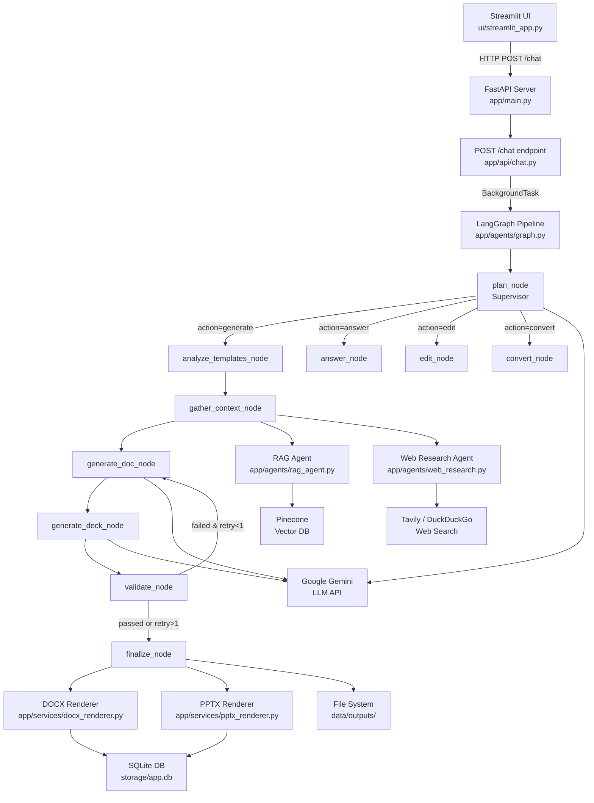

# Multi-Agent Doc & PPT Chatbot — Complete Technical Deep Dive

> **How to use this document:** Every file path, function name, prompt template, and field name in this document was read directly from the source code in this repository. Nothing is paraphrased from a spec or plan document. If an interviewer asks "show me where that happens," you can open the exact file referenced.

---

## 1. One-Paragraph Summary

This is an AI chatbot that takes a simple English request — like "create a proposal and presentation about Generative AI trends" — and automatically researches the topic on the web, pulls relevant facts from a company knowledge base, and generates both an editable Word document and an editable PowerPoint presentation that match the style and tone of your uploaded templates. After generating, you can ask it to edit specific parts ("make slide 3 shorter," "add a pricing section") and it creates a new version without touching the rest, so nothing breaks. Every fact in the output has a citation back to its source, and you can download the files and open them in Microsoft Office like normal documents.

---

## 2. Full Architecture

### Architecture Diagram



### Layer-by-Layer Breakdown

**UI Layer** — A Streamlit single-page app ([`ui/streamlit_app.py`](file:///c:/Users/Onkar/OneDrive/Desktop/AI_MultiAgent_Chatbot/verify-clone/ui/streamlit_app.py)) that provides a chat interface. It authenticates via `POST /auth/login`, then sends user messages with optional file attachments to `POST /chat`. It polls `GET /runs/{run_id}` until the background pipeline finishes, then displays the reply with download links and agent trace steps.

**API Layer** — A FastAPI application ([`app/main.py`](file:///c:/Users/Onkar/OneDrive/Desktop/AI_MultiAgent_Chatbot/verify-clone/app/main.py)) with six routers: `health`, `auth`, `files` (upload), `routes_artifacts` (download/manage artifacts), `knowledge` (KB ingestion), and `chat` (submit messages and poll runs). The `/chat` endpoint ([`app/api/chat.py`](file:///c:/Users/Onkar/OneDrive/Desktop/AI_MultiAgent_Chatbot/verify-clone/app/api/chat.py)) returns `202 Accepted` immediately and schedules graph execution as a `BackgroundTask`.

**Orchestration Layer** — A LangGraph `StateGraph` compiled in [`app/agents/graph.py`](file:///c:/Users/Onkar/OneDrive/Desktop/AI_MultiAgent_Chatbot/verify-clone/app/agents/graph.py). The function [`build_graph()`](file:///c:/Users/Onkar/OneDrive/Desktop/AI_MultiAgent_Chatbot/verify-clone/app/agents/graph.py#L650-L707) wires 11 nodes with conditional edges. State flows through a shared `GraphState` TypedDict ([`app/agents/state.py`](file:///c:/Users/Onkar/OneDrive/Desktop/AI_MultiAgent_Chatbot/verify-clone/app/agents/state.py)). Every node is wrapped in a [`@traced`](file:///c:/Users/Onkar/OneDrive/Desktop/AI_MultiAgent_Chatbot/verify-clone/app/agents/graph.py#L71-L120) decorator that records an `AgentTrace` DB row with timing and error details.

**Agent Layer** — Ten specialist agents, each in its own file under `app/agents/`: supervisor, doc_analyzer, ppt_analyzer, web_research, rag_agent, doc_generator, ppt_generator, validator, editor, converter. Each agent is a pure function that takes specific inputs and returns structured outputs. Details are in Section 3.

**Services Layer** — Shared infrastructure in `app/services/`: parsers (DOCX/PPTX/PDF/image → `ParsedContent`), OCR (Gemini Vision), embeddings (`all-MiniLM-L6-v2` via sentence-transformers), vector_store (Pinecone/InMemory), source_registry (citation tracking), context_builder (aggregates RAG + web), docx_renderer, pptx_renderer, diffing, versioning, file_utils (upload validation), ingestion (KB document chunking).

**Data Layer** — SQLite database at `storage/app.db` managed by SQLAlchemy async ([`app/core/database.py`](file:///c:/Users/Onkar/OneDrive/Desktop/AI_MultiAgent_Chatbot/verify-clone/app/core/database.py)). Tables are auto-created on startup via `create_tables()`. ORM models live in `app/models/`. File outputs are written to `data/outputs/`. LLM responses are disk-cached in `storage/llm_cache/`. Web search results are disk-cached in `storage/search_cache/`.

---

## 3. Every Agent, Explained Individually

### 3.1 Supervisor (Plan Parser)

**File:** [`app/agents/supervisor.py`](file:///c:/Users/Onkar/OneDrive/Desktop/AI_MultiAgent_Chatbot/verify-clone/app/agents/supervisor.py)

**What it does:** Parses the user's natural-language message into a structured execution `Plan` that tells the graph which agents to activate and what to produce.

**Input:** `user_message: str` (from `GraphState`), `file_ids: list[int]`

**Output:** `Plan` Pydantic model with fields: `action` (`"generate"` | `"edit"` | `"convert"` | `"answer"`), `outputs` (`list[Literal["docx","pptx"]]`), `topic` (str), `slide_count` (int, default 12), `use_web` (bool), `use_kb` (bool), `doc_template_file_id` (int|None), `ppt_template_file_id` (int|None).

**LLM calls:** Exactly **1**. Calls `llm_client.generate_json()` with the `Plan` schema. If LLM fails, falls back to regex-based keyword detection (lines 96–119).

**Exact prompt template** (from [`supervisor.py` lines 46–59](file:///c:/Users/Onkar/OneDrive/Desktop/AI_MultiAgent_Chatbot/verify-clone/app/agents/supervisor.py#L46-L59)):
```
You are an intent parser and supervisor planner for an enterprise document & presentation generator chatbot.
Analyze the user's message and output a structured JSON plan matching the Plan schema.

USER MESSAGE:
"{user_message}"

RULES:
1. `action`: Determine if the user wants to "generate" new files, "edit" existing files, "convert" formats, or simply "answer" a question.
2. `outputs`: Select ["docx"], ["pptx"], or ["docx", "pptx"] depending on what the user requested. If both proposal and slides/presentation are requested, output both.
3. `topic`: Extract the core subject/brief to research and write about.
4. `slide_count`: Number of slides requested (default 12).
5. `use_web`: Set true if web research is useful for current facts.
6. `use_kb`: Set true if company KB/context is relevant.
```

**Example:**

| Input | Output |
|---|---|
| `"Research Gen AI trends and create a proposal and 12-slide presentation"` | `Plan(action="generate", outputs=["docx","pptx"], topic="Generative AI trends", slide_count=12, use_web=True, use_kb=True)` |

---

### 3.2 Document Analyzer

**File:** [`app/agents/doc_analyzer.py`](file:///c:/Users/Onkar/OneDrive/Desktop/AI_MultiAgent_Chatbot/verify-clone/app/agents/doc_analyzer.py)

**What it does:** Analyzes a DOCX (or PDF/image) template file and extracts visual styling, section outline, and writing tone into a `TemplateProfile`.

**Input:** `file_path: Path` to a .docx file.

**Output:** `TemplateProfile` containing `doc_style: DocStyleProfile` (margins, heading fonts, body font, palette, outline), `tone: ToneProfile` (formality, voice, person, style_notes), `content_summary: str`, `text_preview: str`.

**LLM calls:** At most **1**. Visual styles (fonts, margins, colors, outline) are extracted via `python-docx` without any LLM call. One LLM call is made to analyze writing tone and content summary, only if the document has text.

**Exact prompt template** (from [`doc_analyzer.py` lines 35–42](file:///c:/Users/Onkar/OneDrive/Desktop/AI_MultiAgent_Chatbot/verify-clone/app/agents/doc_analyzer.py#L35-L42)):
```
Analyze the following text sample from a corporate document template:

--- TEXT SAMPLE ---
{text_sample}
--- END SAMPLE ---

Extract the writing tone profile and a concise 2-3 sentence content summary.
```

**Example:**

| Input | Output (key fields) |
|---|---|
| `Company_Proposal.docx` | `TemplateProfile(doc_style=DocStyleProfile(margins={"top":1.0,...}, heading_styles={"h1": FontInfo(name="Calibri",size_pt=16.0,bold=True)}, body_font=FontInfo(name="Calibri",size_pt=11.0), palette=["#1E3A8A","#0D9488"]), tone=ToneProfile(formality="formal", voice="authoritative", person="first_person_plural"))` |

---

### 3.3 PPT Analyzer

**File:** [`app/agents/ppt_analyzer.py`](file:///c:/Users/Onkar/OneDrive/Desktop/AI_MultiAgent_Chatbot/verify-clone/app/agents/ppt_analyzer.py)

**What it does:** Analyzes a PPTX template, extracting slide layouts, placeholders, decoration scores, theme fonts/colors, and writing tone.

**Input:** `file_path: Path` to a .pptx file.

**Output:** `TemplateProfile` with `ppt_style: PptStyleProfile` containing `layouts: list[SlideLayoutInfo]` (each with `index`, `name`, `role`, `placeholders: list[PlaceholderInfo]`, `decoration_score`), `layout_roles: dict[str,int]`, `theme_fonts`, `theme_colors`, `existing_slides`, `avg_words_per_slide`, plus `tone: ToneProfile` and `content_summary`.

**LLM calls:** At most **1** — for tone analysis, same pattern as doc analyzer. Layout/placeholder inspection is entirely code-based using `python-pptx`.

**Exact prompt template** (from [`ppt_analyzer.py` lines 36–43](file:///c:/Users/Onkar/OneDrive/Desktop/AI_MultiAgent_Chatbot/verify-clone/app/agents/ppt_analyzer.py#L36-L43)):
```
Analyze the following text sample extracted from a PowerPoint presentation:

--- SLIDE TEXT SAMPLE ---
{text_sample}
--- END SAMPLE ---

Extract the presentation tone profile and a concise 2-3 sentence content summary.
```

**Example:**

| Input | Output (key fields) |
|---|---|
| `Green Cream Simple Aesthetic Watercolor Presentation.pptx` | `TemplateProfile(ppt_style=PptStyleProfile(slide_width=10.0, slide_height=5.625, layouts=[SlideLayoutInfo(index=0, name="Title Slide", role="title", decoration_score=22, placeholders=[PlaceholderInfo(idx=0, type="center_title")]),...], layout_roles={"title":0, "title_content":1}))` |

---

### 3.4 Web Research Agent

**File:** [`app/agents/web_research.py`](file:///c:/Users/Onkar/OneDrive/Desktop/AI_MultiAgent_Chatbot/verify-clone/app/agents/web_research.py)

**What it does:** Generates search queries from a topic, executes web searches (Tavily with DuckDuckGo fallback), registers results as citable sources, and synthesizes key findings.

**Input:** `topic: str`, `registry: SourceRegistry`.

**Output:** `ResearchResult` with `queries: list[str]`, `findings: list[FindingItem]` (each has `text: str`, `source_ids: list[int]`), `source_ids: list[int]`.

**LLM calls:** Exactly **2**.
1. **Query generation** — produces up to 3 search queries.
2. **Finding synthesis** — condenses search snippets into 5–8 factual findings with source citations.

**Exact prompt template #1 — query generation** (from [`web_research.py` lines 148–152](file:///c:/Users/Onkar/OneDrive/Desktop/AI_MultiAgent_Chatbot/verify-clone/app/agents/web_research.py#L148-L152)):
```
Topic: '{topic}'
Current Year: 2026
Generate 1 to 3 concise, highly focused web search queries to find current, authoritative facts,
market statistics, and case studies. Include '2026' or 'latest' where relevant.
```

**Exact prompt template #2 — synthesis** (from [`web_research.py` lines 203–209](file:///c:/Users/Onkar/OneDrive/Desktop/AI_MultiAgent_Chatbot/verify-clone/app/agents/web_research.py#L203-L209)):
```
Research Topic: '{topic}'

Source Snippets:
{snippets_formatted}

Based ONLY on the provided snippets above, extract 5 to 8 short, factual key findings.
For each finding, provide the text and the list of integer source_ids backing it.
Never invent facts not present in the snippets.
```

**Example:**

| Input | Output |
|---|---|
| `topic="Generative AI trends 2026"` | `ResearchResult(queries=["Generative AI enterprise adoption 2026", "agentic AI market size 2026"], findings=[FindingItem(text="72% of mid-size enterprises plan agentic workflow adoption by Q3 2026", source_ids=[1,3]),...], source_ids=[1,2,3,4,5])` |

---

### 3.5 RAG Agent

**File:** [`app/agents/rag_agent.py`](file:///c:/Users/Onkar/OneDrive/Desktop/AI_MultiAgent_Chatbot/verify-clone/app/agents/rag_agent.py)

**What it does:** Embeds a query locally, queries Pinecone for the top-k most similar enterprise knowledge base chunks, filters by minimum cosine similarity score, and registers hits as citable sources.

**Input:** `query: str`, `top_k: int` (default 5), `min_score: float` (default 0.3), `registry: SourceRegistry`.

**Output:** `list[dict]` where each dict has `source_id: int`, `score: float`, `title: str`, `text: str`, `metadata: dict`.

**LLM calls:** **0**. This agent uses zero LLM calls. Embedding is done locally via `sentence-transformers` ([`app/services/embeddings.py`](file:///c:/Users/Onkar/OneDrive/Desktop/AI_MultiAgent_Chatbot/verify-clone/app/services/embeddings.py)), and vector search is done via Pinecone API.

**Example:**

| Input | Output |
|---|---|
| `query="AI automation for enterprises"` | `[{"source_id": 1, "score": 0.82, "title": "NexaWorks Company Overview - AI Solutions", "text": "NexaWorks AI Solutions delivers enterprise-grade automation..."}]` |

---

### 3.6 Document Generator

**File:** [`app/agents/doc_generator.py`](file:///c:/Users/Onkar/OneDrive/Desktop/AI_MultiAgent_Chatbot/verify-clone/app/agents/doc_generator.py)

**What it does:** Produces a structured `DocumentModel` (JSON) for a business proposal, following the template's outline and tone, citing sources.

**Input:** `brief: str` (topic + any retry feedback), `profile: TemplateProfile`, `sources: list[dict]`.

**Output:** `DocumentModel` with `title`, `subtitle`, `client_name`, `date`, `sections: list[Section]` (each has `heading`, `level`, `blocks: list[ParagraphBlock | BulletsBlock | TableBlock]`).

**LLM calls:** **1** (or 2 if first attempt fails Pydantic validation — the function retries once with error context appended).

**Exact prompt template** (from [`doc_generator.py` lines 14–40](file:///c:/Users/Onkar/OneDrive/Desktop/AI_MultiAgent_Chatbot/verify-clone/app/agents/doc_generator.py#L14-L40)):
```
You are an expert technical proposal writer for NexaWorks AI Solutions (Pune, India).
Generate a comprehensive, detailed, 3-to-4 page business proposal matching the user's brief.

--- USER BRIEF ---
{brief}

--- TEMPLATE OUTLINE & SECTION HEADINGS ---
{template_outline}

--- TARGET STYLE & TONE ---
Formality: {formality}
Voice: {voice}
Person: {person}
Style Notes: {style_notes}

--- AVAILABLE SOURCES ---
{sources_formatted}

--- MANDATORY CONTENT RULES ---
1. You MUST return a valid JSON object matching the DocumentModel schema.
2. Follow the TEMPLATE OUTLINE HEADINGS in exact sequence. Include 6 to 8 detailed sections.
3. Target document length is 3 to 4 pages (each section MUST contain 100 to 180 words of thorough text, bullets, or tables).
4. All facts, metrics, pricing figures, and market claims MUST cite provided `source_ids`. Never invent statistics.
5. Include structured TableBlock elements for Timeline and Pricing/Commercial Investment if present in outline.
6. Use clear active voice with direct, professional, short sentences.
{extra_error_context}
```

---

### 3.7 PPT Generator

**File:** [`app/agents/ppt_generator.py`](file:///c:/Users/Onkar/OneDrive/Desktop/AI_MultiAgent_Chatbot/verify-clone/app/agents/ppt_generator.py)

**What it does:** Produces a structured `DeckModel` (JSON) for a PowerPoint presentation with the exact number of requested slides, role assignments, bullet content, speaker notes, and source citations.

**Input:** `brief: str`, `profile: TemplateProfile`, `sources: list[dict]`, `slide_count: int`.

**Output:** `DeckModel` with `title: str`, `slides: list[SlideModel]` (each has `role: SlideRole`, `title`, `subtitle`, `bullets: list[BulletItem]`, `left`/`right` for two-content, `notes`, `source_ids`).

**LLM calls:** **1** (or 2 if first attempt fails). Post-LLM, [`_validate_and_adjust_deck()`](file:///c:/Users/Onkar/OneDrive/Desktop/AI_MultiAgent_Chatbot/verify-clone/app/agents/ppt_generator.py#L104-L112) truncates slides to match `target_count` if the LLM over-generated.

**Exact prompt template** (from [`ppt_generator.py` lines 14–49](file:///c:/Users/Onkar/OneDrive/Desktop/AI_MultiAgent_Chatbot/verify-clone/app/agents/ppt_generator.py#L14-L49)):
```
You are an expert presentation designer and executive speechwriter for NexaWorks AI Solutions.
Generate a comprehensive, highly professional PowerPoint presentation deck matching the user's brief.

--- USER BRIEF ---
{brief}

--- TARGET SLIDE COUNT ---
EXACTLY {slide_count} slides (excluding the Sources slide).

--- TARGET STYLE & TONE ---
Formality: {formality}
Voice: {voice}
Person: {person}

--- ALLOWED SLIDE ROLES ---
- "title": Title slide (MUST be Slide 1)
- "section_header": Topic transition header slide (use 2-3 throughout the deck)
- "title_content": Standard title + bullet list slide
- "two_content": Title + left column bullets + right column bullets (MUST compare two distinct items/approaches)
- "title_only": Single high-impact callout slide

--- AVAILABLE SOURCES ---
{sources_formatted}

--- MANDATORY SLIDE CONTENT RULES ---
1. You MUST return a valid JSON object matching the DeckModel schema.
2. The `slides` array MUST contain EXACTLY {slide_count} slides.
3. Slide 1 MUST have role="title".
4. For every content slide (`title_content`, `two_content`), provide 4 to 6 detailed bullet points.
5. Each bullet MUST contain 12 to 20 words with concrete numbers, metrics, and facts from the sources.
6. `two_content` slides MUST compare two things (e.g., Traditional Manual Operations vs NexaWorks Multi-Agent Automation).
7. Every slide MUST include 2 to 3 detailed sentences of speaker notes in `notes`.
8. Total words per slide must stay around 80 to 90 words.
9. ONLY use facts from the provided sources and cite them by `source_ids`; do NOT invent sources or IDs.
{extra_error_context}
```

---

### 3.8 Validator

**File:** [`app/agents/validator.py`](file:///c:/Users/Onkar/OneDrive/Desktop/AI_MultiAgent_Chatbot/verify-clone/app/agents/validator.py)

**What it does:** Performs deterministic (no-LLM) quality checks on generated `DocumentModel` and `DeckModel`, producing a pass/fail report with a numeric score.

**Input:** `doc_model: DocumentModel | None`, `deck_model: DeckModel | None`, `expected_slide_count: int`, `valid_source_ids: set[int]`.

**Output:** `ValidationReport` with `passed: bool`, `score: float` (0–100), `issues: list[ValidationIssue]` (each has `severity: "error"|"warning"`, `where: str`, `message: str`).

**LLM calls:** **0**. All checks are code-based regex and counting logic.

**Full list of checks:** See Section 10.

---

### 3.9 Editor

**File:** [`app/agents/editor.py`](file:///c:/Users/Onkar/OneDrive/Desktop/AI_MultiAgent_Chatbot/verify-clone/app/agents/editor.py)

**What it does:** Takes a conversational edit instruction (e.g., "make slide 3 shorter") and applies it as a set of granular operations to an existing artifact's JSON model, then re-renders and saves a new version.

**Input:** `artifact_id: int`, `instruction: str`, `db_session: Session`.

**Output:** `EditResult` with `artifact_id`, `new_version_no`, `summary`, `diff: dict`, `file_path`, `download_url`, `llm_calls`.

**LLM calls:** **1** for the edit plan (parsing instruction into `EditPlan`). May use **+1** if the plan includes a `condense_deck` op (rewrites slides shorter), or **+1** if the plan includes a `refresh_with_web` op (researches new content and re-generates).

**Exact prompt template** (from [`editor.py` lines 57–78](file:///c:/Users/Onkar/OneDrive/Desktop/AI_MultiAgent_Chatbot/verify-clone/app/agents/editor.py#L57-L78)):
```
You are an expert technical editor.
The user wants to make a conversational edit to an existing document or presentation deck.

USER INSTRUCTION:
"{instruction}"

CURRENT ARTIFACT TYPE: {artifact_type}
CURRENT OUTLINE / CONTENT SUMMARY:
{outline_summary}

TEMPLATE OUTLINE / LAYOUT ROLES:
{layout_roles}

TONE PROFILE:
{tone_profile}

RULES:
1. Return a valid EditPlan object containing the target, list of ops to perform, and a clear summary.
2. Change ONLY what the user asked for. Keep everything else identical.
3. Keep the same tone throughout.
4. Cite sources for new facts using valid source_ids.
```

---

### 3.10 Converter

**File:** [`app/agents/converter.py`](file:///c:/Users/Onkar/OneDrive/Desktop/AI_MultiAgent_Chatbot/verify-clone/app/agents/converter.py)

**What it does:** Converts an existing artifact between DOCX and PPTX formats by transforming one JSON model into the other via a single LLM call.

**Input:** `artifact_id: int`, `target_kind: "docx" | "pptx"`, `db_session: Session`.

**Output:** `ConvertResult` with `new_artifact_id`, `target_kind`, `title`, `version_no`, `file_path`, `download_url`.

**LLM calls:** Exactly **1**. Sends the source model's JSON and asks Gemini to transform it to the target schema.

**Exact prompt template (DOCX→PPTX)** (from [`converter.py` lines 40–52](file:///c:/Users/Onkar/OneDrive/Desktop/AI_MultiAgent_Chatbot/verify-clone/app/agents/converter.py#L40-L52)):
```
You are an expert presentation designer.
Convert the following technical document proposal into a structured PowerPoint presentation deck matching the DeckModel schema.

TARGET SLIDE COUNT: {slide_count} slides.

DOCUMENT CONTENT:
{doc_json}

RULES:
1. Preserve all facts, metrics, and source_ids from the original document.
2. Slide 1 MUST have role="title".
3. Content slides MUST have 3 to 5 detailed bullet points.
```

**Exact prompt template (PPTX→DOCX)** (from [`converter.py` lines 54–64](file:///c:/Users/Onkar/OneDrive/Desktop/AI_MultiAgent_Chatbot/verify-clone/app/agents/converter.py#L54-L64)):
```
You are an expert technical proposal writer.
Convert the following presentation deck into a comprehensive, detailed technical proposal document matching the DocumentModel schema.

PRESENTATION DECK CONTENT:
{deck_json}

RULES:
1. Expand slide bullets into rich, thorough paragraphs and structured tables.
2. Preserve all facts, metrics, and source_ids from the slides.
3. Include at least 6 structured sections.
```

---

## 4. External Services and API Keys

### 4.1 Google Gemini

**What it's used for:** All LLM calls — intent parsing, tone analysis, document generation, deck generation, editing, conversion, OCR (vision), and web research query/synthesis.

**Client initialization:** [`app/llm/client.py`](file:///c:/Users/Onkar/OneDrive/Desktop/AI_MultiAgent_Chatbot/verify-clone/app/llm/client.py) line 103: `self._client = genai.Client(api_key=api_key)`. The key is read from `.env` as `GEMINI_API_KEY` via [`app/core/config.py`](file:///c:/Users/Onkar/OneDrive/Desktop/AI_MultiAgent_Chatbot/verify-clone/app/core/config.py) line 18.

**What gets sent:** For structured JSON output, the code calls `self._client.models.generate_content(model=model_name, contents=prompt, config=GenerateContentConfig(temperature=0.3, system_instruction=system, response_mime_type="application/json", response_schema=PydanticSchema))`. For plain text, `response_mime_type` and `response_schema` are omitted. For vision/OCR, `contents` includes both a `Part.from_text` and a `Part.from_bytes` with image data.

**What comes back:** `response.text` — a string that is either raw text or JSON validated against the Pydantic schema.

**Retry and fallback logic** (from [`client.py` lines 308–370](file:///c:/Users/Onkar/OneDrive/Desktop/AI_MultiAgent_Chatbot/verify-clone/app/llm/client.py#L308-L370)):
```python
models = [self._primary, self._fallback]  # e.g. ["gemini-2.5-flash", "gemini-2.5-flash-lite"]

for model_name in models:
    for attempt in range(1, self._max_retries + 1):  # default max_retries=3
        try:
            res = self._single_call(model_name, prompt, ...)
            return res
        except Exception as exc:
            is_retryable = any(code in str(exc) for code in ("429", "500", "502", "503", "504"))
            if is_retryable and attempt < self._max_retries:
                wait = 2 ** attempt   # exponential backoff: 2s, 4s, 8s
                time.sleep(wait)
            else:
                break  # try fallback model
    logger.info("Falling back from '%s' to next model…", model_name)

raise RuntimeError("All LLM models exhausted after retries")
```

**Disk cache:** LLM responses are cached using SHA-256 of `model::system::prompt::schema_name` as key, stored as JSON files in `storage/llm_cache/`. Cache is checked before every call when `use_cache=True`.

**Where to get a key:** [Google AI Studio](https://aistudio.google.com/). Free tier: 15 RPM for Flash models, 1,500 requests/day. We've hit 429 rate limits when running the full pipeline repeatedly — the exponential backoff handles this.

---

### 4.2 Pinecone

**What it's used for:** Storing and querying enterprise knowledge base document embeddings for RAG retrieval.

**Client initialization:** [`app/services/vector_store.py`](file:///c:/Users/Onkar/OneDrive/Desktop/AI_MultiAgent_Chatbot/verify-clone/app/services/vector_store.py) lines 56–80. Key read from `.env` as `PINECONE_API_KEY`. The code does:
```python
from pinecone import Pinecone, ServerlessSpec
self._pc = Pinecone(api_key=api_key)
# Auto-creates index if missing:
self._pc.create_index(name=index_name, dimension=384, metric="cosine",
                      spec=ServerlessSpec(cloud="aws", region="us-east-1"))
self._index = self._pc.Index(index_name)
```

**What gets sent:** `self._index.upsert(vectors=[{"id": str, "values": list[float], "metadata": dict}], namespace="enterprise-kb")` for ingestion. `self._index.query(vector=list[float], top_k=5, include_metadata=True, namespace="enterprise-kb")` for retrieval.

**What comes back:** `{"matches": [{"id": str, "score": float, "metadata": {"source_name": str, "heading": str, "text": str}}]}`.

**On failure:** If `PINECONE_API_KEY` is missing or connection fails, [`get_vector_store()`](file:///c:/Users/Onkar/OneDrive/Desktop/AI_MultiAgent_Chatbot/verify-clone/app/services/vector_store.py#L211-L228) falls back to `InMemoryStore` (lines 224–228), which implements the same `VectorStore` protocol using cosine similarity in pure Python.

**Where to get a key:** [Pinecone.io](https://www.pinecone.io/). Free Starter plan: 1 serverless index, 2 GB storage, unlimited reads. Sufficient for this POC.

---

### 4.3 Tavily

**What it's used for:** Real-time web search to find current facts, statistics, and articles for the research agent.

**Client initialization:** [`app/agents/web_research.py`](file:///c:/Users/Onkar/OneDrive/Desktop/AI_MultiAgent_Chatbot/verify-clone/app/agents/web_research.py) lines 73–87. Key read from `.env` as `TAVILY_API_KEY`.
```python
from tavily import TavilyClient
tav = TavilyClient(api_key=tavily_key)
tav_res = tav.search(query=query, search_depth="basic", max_results=4)
```

**What gets sent:** A query string (e.g., `"Generative AI enterprise adoption 2026"`).

**What comes back:** `{"results": [{"title": str, "url": str, "content": str, "published_date": str|None}]}`.

**On failure** (from [`web_research.py` lines 85–103](file:///c:/Users/Onkar/OneDrive/Desktop/AI_MultiAgent_Chatbot/verify-clone/app/agents/web_research.py#L85-L103)):
```python
# Fallback to DuckDuckGo if Tavily key is missing or failed
if not results:
    from duckduckgo_search import DDGS
    with DDGS() as ddgs:
        ddg_res = list(ddgs.text(query, max_results=max_results))
```

Search results are disk-cached per query+date in `storage/search_cache/` using MD5 hash of `query_today` as filename.

**Where to get a key:** [Tavily.com](https://tavily.com/). Free tier: 1,000 searches/month. DuckDuckGo fallback requires no key but has rate limits.

---

## 5. End-to-End Walkthrough

**User request:** *"Research the latest Generative AI trends and create a proposal and 12-slide presentation using the same tone and style as the uploaded files."*  
**Assume:** User has uploaded `Company_Proposal.docx` (file_id=1) and `Green Cream Simple Aesthetic Watercolor Presentation.pptx` (file_id=2).

### Step 1: UI → API (`POST /chat`)

[`app/api/chat.py` `create_chat_run()`](file:///c:/Users/Onkar/OneDrive/Desktop/AI_MultiAgent_Chatbot/verify-clone/app/api/chat.py#L91-L141):

1. Generates `run_id = "run_a1b2c3d4e5"`, `session_id = "sess_f6g7h8i9j0"`.
2. **DB writes:** Creates `ChatSession` row, `ChatMessage` row (role="user"), `AgentRun` row (status="running").
3. Schedules `_run_graph_background()` as a FastAPI `BackgroundTask`.
4. Returns `{"run_id": "run_a1b2c3d4e5", "session_id": "sess_f6g7h8i9j0", "status": "running"}` — HTTP 202.

### Step 2: Graph Initialization

[`_run_graph_background()`](file:///c:/Users/Onkar/OneDrive/Desktop/AI_MultiAgent_Chatbot/verify-clone/app/api/chat.py#L35-L88) creates `GraphState`:
```python
initial_state = {
    "run_id": "run_a1b2c3d4e5",
    "session_id": "sess_f6g7h8i9j0",
    "user_message": "Research the latest Generative AI trends and create...",
    "file_ids": [1, 2],
    "artifacts": [], "errors": [], "retry_count": 0, "findings": [], "template_profiles": {},
}
```
Calls `graph_app.invoke(initial_state)`.

### Step 3: `plan_node` (Supervisor)

[`node_plan()`](file:///c:/Users/Onkar/OneDrive/Desktop/AI_MultiAgent_Chatbot/verify-clone/app/agents/graph.py#L125-L152) calls `parse_plan()`. **1 LLM call.** Regex extracts `slide_count=12`. LLM returns:
```python
Plan(action="generate", outputs=["docx","pptx"], topic="latest Generative AI trends",
     slide_count=12, use_web=True, use_kb=True)
```
Then queries `UploadedFile` table: file_id=1 → `.docx` → sets `plan.doc_template_file_id=1`; file_id=2 → `.pptx` → sets `plan.ppt_template_file_id=2`.

**GraphState after:** `plan = {...}`, `retry_count = 0`.

**Routing:** [`route_intent()`](file:///c:/Users/Onkar/OneDrive/Desktop/AI_MultiAgent_Chatbot/verify-clone/app/agents/graph.py#L615-L627) returns `"analyze_templates_node"` because `action == "generate"`.

**DB write:** `AgentTrace` row for `plan_node`.

### Step 4: `analyze_templates_node`

[`node_analyze_templates()`](file:///c:/Users/Onkar/OneDrive/Desktop/AI_MultiAgent_Chatbot/verify-clone/app/agents/graph.py#L192-L226) looks up `UploadedFile` rows for file IDs 1 and 2, resolves their `stored_path`, then calls:
- `analyze_document(doc_tmpl_path)` — **1 LLM call** (tone analysis).
- `analyze_presentation(ppt_tmpl_path)` — **1 LLM call** (tone analysis).

**GraphState after:** `template_profiles = {"doc_profile": {...}, "ppt_profile": {...}, "doc_template_path": "...", "ppt_template_path": "..."}`.

### Step 5: `gather_context_node`

[`node_gather_context()`](file:///c:/Users/Onkar/OneDrive/Desktop/AI_MultiAgent_Chatbot/verify-clone/app/agents/graph.py#L229-L241) calls [`build_context()`](file:///c:/Users/Onkar/OneDrive/Desktop/AI_MultiAgent_Chatbot/verify-clone/app/services/context_builder.py#L39-L103) which:

1. **RAG retrieval:** [`retrieve()`](file:///c:/Users/Onkar/OneDrive/Desktop/AI_MultiAgent_Chatbot/verify-clone/app/agents/rag_agent.py#L20-L107) embeds the topic locally (`embed_query()` — **0 LLM calls**), queries Pinecone, filters by `min_score=0.3`, registers hits in `SourceRegistry`. Returns ~3–5 KB chunks.

2. **Web research:** [`research()`](file:///c:/Users/Onkar/OneDrive/Desktop/AI_MultiAgent_Chatbot/verify-clone/app/agents/web_research.py#L116-L250) — **2 LLM calls** (query generation + synthesis). Executes 1–3 Tavily searches (each returning up to 4 results). Registers ~8–12 web sources.

**GraphState after:** `registry = {1: {"title":..., "url":..., "snippet":...}, 2: {...}, ...}`, `findings = [{text:..., source_ids:[1,3]}, ...]`.

### Step 6: `generate_doc_node`

[`node_generate_doc()`](file:///c:/Users/Onkar/OneDrive/Desktop/AI_MultiAgent_Chatbot/verify-clone/app/agents/graph.py#L244-L278) calls [`generate_document_model()`](file:///c:/Users/Onkar/OneDrive/Desktop/AI_MultiAgent_Chatbot/verify-clone/app/agents/doc_generator.py#L43-L109). **1 LLM call.** Produces a `DocumentModel` with 6–8 sections, each containing `ParagraphBlock`, `BulletsBlock`, or `TableBlock` objects with `source_ids`.

**GraphState after:** `doc_model = {"title": "AI-Driven Enterprise Transformation Proposal", "sections": [...]}`.

### Step 7: `generate_deck_node`

[`node_generate_deck()`](file:///c:/Users/Onkar/OneDrive/Desktop/AI_MultiAgent_Chatbot/verify-clone/app/agents/graph.py#L281-L317) calls [`generate_deck_model()`](file:///c:/Users/Onkar/OneDrive/Desktop/AI_MultiAgent_Chatbot/verify-clone/app/agents/ppt_generator.py#L52-L101). **1 LLM call.** Produces a `DeckModel` with exactly 12 slides.

**GraphState after:** `deck_model = {"title": "...", "slides": [12 SlideModel objects]}`.

### Step 8: `validate_node`

[`node_validate()`](file:///c:/Users/Onkar/OneDrive/Desktop/AI_MultiAgent_Chatbot/verify-clone/app/agents/graph.py#L320-L342) calls [`validate_outputs()`](file:///c:/Users/Onkar/OneDrive/Desktop/AI_MultiAgent_Chatbot/verify-clone/app/agents/validator.py#L37-L195). **0 LLM calls.** Runs all deterministic checks.

**GraphState after:** `validation = {"passed": true, "score": 90.0, "issues": [...]}`.

**Routing:** [`should_retry()`](file:///c:/Users/Onkar/OneDrive/Desktop/AI_MultiAgent_Chatbot/verify-clone/app/agents/graph.py#L630-L645) returns `"finalize_node"` because `passed=True` (or `retry_count >= 1`).

### Step 9: `finalize_node`

[`node_finalize()`](file:///c:/Users/Onkar/OneDrive/Desktop/AI_MultiAgent_Chatbot/verify-clone/app/agents/graph.py#L345-L470):

1. **Render DOCX:** Calls [`render_docx(doc_model, doc_tmpl_path, doc_profile, out_docx, sources_map)`](file:///c:/Users/Onkar/OneDrive/Desktop/AI_MultiAgent_Chatbot/verify-clone/app/services/docx_renderer.py#L27-L203). **File created:** `data/outputs/Proposal_a1b2c3d4.docx`.

2. **DB writes for DOCX:** `Artifact` row (artifact_type="docx", title="..."), `ArtifactVersion` row (version_no=1, model_json=`doc_model JSON`, file_path=...).

3. **Render PPTX:** Calls [`render_pptx(deck_model, ppt_tmpl_path, ppt_profile, out_pptx, sources_map)`](file:///c:/Users/Onkar/OneDrive/Desktop/AI_MultiAgent_Chatbot/verify-clone/app/services/pptx_renderer.py#L22-L137). **File created:** `data/outputs/Deck_e5f6g7h8.pptx`.

4. **DB writes for PPTX:** `Artifact` row, `ArtifactVersion` row.

5. **Formats reply** with download links and citation summary.

**GraphState after:** `reply = "### Generation Completed Successfully\n**Generated Artifacts:**\n- [DOCX] **AI-Driven Enterprise...**\n..."`, `artifacts = [{kind:"docx", artifact_id:1, ...}, {kind:"pptx", artifact_id:2, ...}]`.

### Step 10: Background Task Completes

Back in [`_run_graph_background()`](file:///c:/Users/Onkar/OneDrive/Desktop/AI_MultiAgent_Chatbot/verify-clone/app/api/chat.py#L60-L88):

- Updates `AgentRun` row: `status="done"`, `result_json={reply, artifacts, citations, validation, errors}`, `finished_at=now`.
- Creates `ChatMessage` row (role="assistant", content=reply).

### Total LLM Calls for This Run

| Agent | Calls |
|---|---|
| Supervisor | 1 |
| Doc Analyzer (tone) | 1 |
| PPT Analyzer (tone) | 1 |
| Web Research (queries + synthesis) | 2 |
| RAG Agent | 0 |
| Doc Generator | 1 |
| PPT Generator | 1 |
| Validator | 0 |
| **Total** | **7** |

---

## 6. Data Models (Pydantic)

### `Plan` ([`app/agents/supervisor.py`](file:///c:/Users/Onkar/OneDrive/Desktop/AI_MultiAgent_Chatbot/verify-clone/app/agents/supervisor.py#L16-L43))
| Field | Type | Purpose |
|---|---|---|
| `action` | `Literal["generate","edit","convert","answer"]` | Primary action requested |
| `outputs` | `list[Literal["docx","pptx"]]` | Which file formats to produce |
| `topic` | `str` | Cleaned user topic or brief |
| `slide_count` | `int` (default 12) | Target number of slides |
| `use_web` | `bool` | Whether to run web research |
| `use_kb` | `bool` | Whether to query enterprise KB |
| `doc_template_file_id` | `int \| None` | Uploaded DOCX template file ID |
| `ppt_template_file_id` | `int \| None` | Uploaded PPTX template file ID |

### `TemplateProfile` ([`app/models/template_profile.py`](file:///c:/Users/Onkar/OneDrive/Desktop/AI_MultiAgent_Chatbot/verify-clone/app/models/template_profile.py#L87-L97))
| Field | Type | Purpose |
|---|---|---|
| `file_id` | `int \| str \| None` | Source file identifier |
| `file_type` | `str` | "docx", "pptx", etc. |
| `source_name` | `str` | Original filename |
| `doc_style` | `DocStyleProfile \| None` | Visual styling for documents |
| `ppt_style` | `PptStyleProfile \| None` | Theme/layout info for presentations |
| `tone` | `ToneProfile` | Linguistic tone analysis |
| `content_summary` | `str` | Brief content description |
| `text_preview` | `str` | First ~1000 chars of content |

### `ToneProfile` ([`template_profile.py`](file:///c:/Users/Onkar/OneDrive/Desktop/AI_MultiAgent_Chatbot/verify-clone/app/models/template_profile.py#L50-L57))
| Field | Type | Purpose |
|---|---|---|
| `formality` | `str` | "formal", "semi-formal", "casual" |
| `voice` | `str` | "authoritative", "technical", etc. |
| `person` | `str` | "first_person_plural", "third_person", etc. |
| `avg_sentence_length` | `float` | Typical words per sentence |
| `style_notes` | `list[str]` | Key writing style observations |
| `typical_openings` | `list[str]` | Common section-opening phrases |

### `DocStyleProfile` ([`template_profile.py`](file:///c:/Users/Onkar/OneDrive/Desktop/AI_MultiAgent_Chatbot/verify-clone/app/models/template_profile.py#L60-L72))
| Field | Type | Purpose |
|---|---|---|
| `page_size` | `str` | e.g. "A4" |
| `margins` | `dict[str,float]` | top/bottom/left/right in inches |
| `heading_styles` | `dict[str,FontInfo]` | Font info per heading level (h1, h2...) |
| `body_font` | `FontInfo` | Default body text font |
| `line_spacing` | `float` | Line spacing multiplier |
| `palette` | `list[str]` | Brand color hex codes |
| `outline` | `list[dict]` | Section headings with levels |

### `PptStyleProfile` ([`template_profile.py`](file:///c:/Users/Onkar/OneDrive/Desktop/AI_MultiAgent_Chatbot/verify-clone/app/models/template_profile.py#L75-L84))
| Field | Type | Purpose |
|---|---|---|
| `slide_width` / `slide_height` | `float` | Slide dimensions in inches |
| `theme_fonts` | `dict[str,str]` | Major and minor theme font names |
| `theme_colors` | `dict[str,str]` | Primary, secondary, background colors |
| `layouts` | `list[SlideLayoutInfo]` | All available slide layouts |
| `layout_roles` | `dict[str,int]` | Best layout index per role |
| `existing_slides` | `list[dict]` | Summary of existing slides |
| `avg_words_per_slide` | `float` | Average word count |

### `SlideLayoutInfo` ([`template_profile.py`](file:///c:/Users/Onkar/OneDrive/Desktop/AI_MultiAgent_Chatbot/verify-clone/app/models/template_profile.py#L40-L47))
| Field | Type | Purpose |
|---|---|---|
| `index` | `int` | Position in slide_layouts list |
| `name` | `str` | Layout display name |
| `role` | `SlideRole` | Detected functional role |
| `placeholders` | `list[PlaceholderInfo]` | Placeholder shapes |
| `decoration_score` | `int` | Non-placeholder shape count (higher = more decoration) |
| `role_candidates` | `list[str]` | All roles this layout could serve |

### `DocumentModel` ([`app/models/document_model.py`](file:///c:/Users/Onkar/OneDrive/Desktop/AI_MultiAgent_Chatbot/verify-clone/app/models/document_model.py))
| Field | Type | Purpose |
|---|---|---|
| `title` | `str` | Document title |
| `subtitle` | `str` | Subtitle line |
| `client_name` | `str` | Prepared-for client |
| `date` | `str` | Document date |
| `sections` | `list[Section]` | Ordered document sections |

### `Section` / Block types ([`document_model.py`](file:///c:/Users/Onkar/OneDrive/Desktop/AI_MultiAgent_Chatbot/verify-clone/app/models/document_model.py#L35-L39))
- `Section`: `heading: str`, `level: int` (1–3), `blocks: list[Block]`
- `ParagraphBlock`: `type="paragraph"`, `text: str`, `source_ids: list[int]`
- `BulletsBlock`: `type="bullets"`, `items: list[str]`, `ordered: bool`, `source_ids: list[int]`
- `TableBlock`: `type="table"`, `headers: list[str]`, `rows: list[list[str]]`, `source_ids: list[int]`

### `DeckModel` ([`app/models/deck_model.py`](file:///c:/Users/Onkar/OneDrive/Desktop/AI_MultiAgent_Chatbot/verify-clone/app/models/deck_model.py))
| Field | Type | Purpose |
|---|---|---|
| `title` | `str` | Deck title |
| `slides` | `list[SlideModel]` | Ordered slides |

### `SlideModel` ([`deck_model.py`](file:///c:/Users/Onkar/OneDrive/Desktop/AI_MultiAgent_Chatbot/verify-clone/app/models/deck_model.py#L19-L28))
| Field | Type | Purpose |
|---|---|---|
| `role` | `SlideRole` | "title", "section_header", "title_content", "two_content", "title_only" |
| `title` | `str` | Slide heading |
| `subtitle` | `str` | Subtitle (title/section slides) |
| `bullets` | `list[BulletItem]` | Content bullets for title_content |
| `left` / `right` | `list[BulletItem]` | Left/right columns for two_content |
| `notes` | `str` | Speaker notes |
| `source_ids` | `list[int]` | Slide-level source citations |

### `BulletItem` ([`deck_model.py`](file:///c:/Users/Onkar/OneDrive/Desktop/AI_MultiAgent_Chatbot/verify-clone/app/models/deck_model.py#L9-L13))
`text: str`, `level: int` (0 or 1), `source_ids: list[int]`

### `EditPlan` ([`app/models/edit_ops.py`](file:///c:/Users/Onkar/OneDrive/Desktop/AI_MultiAgent_Chatbot/verify-clone/app/models/edit_ops.py#L96-L101))
| Field | Type | Purpose |
|---|---|---|
| `target` | `Literal["docx","pptx","both"]` | Which format is being edited |
| `ops` | `list[Op]` | Granular edit operations |
| `summary` | `str` | Human-readable change summary |

**Op types:** `AddSectionOp`, `UpdateSectionOp`, `DeleteSectionOp`, `AddSlideOp`, `UpdateSlideOp`, `DeleteSlideOp`, `MoveSlideOp`, `CondenseDeckOp`, `RefreshWithWebOp` (all in [`edit_ops.py`](file:///c:/Users/Onkar/OneDrive/Desktop/AI_MultiAgent_Chatbot/verify-clone/app/models/edit_ops.py)).

### `ValidationReport` ([`app/agents/validator.py`](file:///c:/Users/Onkar/OneDrive/Desktop/AI_MultiAgent_Chatbot/verify-clone/app/agents/validator.py#L22-L28))
`passed: bool`, `score: float` (0–100), `issues: list[ValidationIssue]`

### `ValidationIssue` ([`validator.py`](file:///c:/Users/Onkar/OneDrive/Desktop/AI_MultiAgent_Chatbot/verify-clone/app/agents/validator.py#L14-L19))
`severity: "error" | "warning"`, `where: str` (e.g. "pptx:slide_3"), `message: str`

### `ResearchResult` / `FindingItem` ([`web_research.py`](file:///c:/Users/Onkar/OneDrive/Desktop/AI_MultiAgent_Chatbot/verify-clone/app/agents/web_research.py#L32-L47))
- `ResearchResult`: `queries: list[str]`, `findings: list[FindingItem]`, `source_ids: list[int]`
- `FindingItem`: `text: str`, `source_ids: list[int]`

### `ContextResult` ([`app/services/context_builder.py`](file:///c:/Users/Onkar/OneDrive/Desktop/AI_MultiAgent_Chatbot/verify-clone/app/services/context_builder.py#L18-L36))
`brief: str`, `sources_map: dict`, `sources_list: list`, `findings: list[FindingItem]`, `kb_hits: list[dict]`, `queries: list[str]`

### `EditResult` ([`app/agents/editor.py`](file:///c:/Users/Onkar/OneDrive/Desktop/AI_MultiAgent_Chatbot/verify-clone/app/agents/editor.py#L45-L54))
`artifact_id: int`, `new_version_no: int`, `summary: str`, `diff: dict`, `file_path: str`, `download_url: str`, `llm_calls: int`

### `ConvertResult` ([`app/agents/converter.py`](file:///c:/Users/Onkar/OneDrive/Desktop/AI_MultiAgent_Chatbot/verify-clone/app/agents/converter.py#L29-L37))
`new_artifact_id: int`, `target_kind: str`, `title: str`, `version_no: int`, `file_path: str`, `download_url: str`

---

## 7. Database Schema

All tables use `TimestampMixin` adding `created_at` and `updated_at` (UTC datetime) columns. Engine: SQLite via `aiosqlite`.

### `users` ([`app/models/user.py`](file:///c:/Users/Onkar/OneDrive/Desktop/AI_MultiAgent_Chatbot/verify-clone/app/models/user.py))
| Column | Type | Purpose |
|---|---|---|
| `id` | INTEGER PK | Auto-increment user ID |
| `username` | VARCHAR(100) UNIQUE | Login username |
| `hashed_password` | VARCHAR(255) | pbkdf2_sha256 hashed password |

### `projects` ([`app/models/project.py`](file:///c:/Users/Onkar/OneDrive/Desktop/AI_MultiAgent_Chatbot/verify-clone/app/models/project.py))
| Column | Type | Purpose |
|---|---|---|
| `id` | INTEGER PK | Auto-increment project ID |
| `name` | VARCHAR(255) | Project display name |
| `description` | TEXT nullable | Project description |
| `user_id` | FK → users.id | Owner reference |

### `uploaded_files` ([`app/models/file.py`](file:///c:/Users/Onkar/OneDrive/Desktop/AI_MultiAgent_Chatbot/verify-clone/app/models/file.py))
| Column | Type | Purpose |
|---|---|---|
| `id` | INTEGER PK | Auto-increment file ID |
| `filename` | VARCHAR(255) | Original uploaded filename |
| `file_type` | VARCHAR(20) | Extension: docx, pdf, pptx, png, etc. |
| `file_size` | INTEGER | File size in bytes |
| `stored_path` | VARCHAR(1000) | Absolute path on disk |

### `artifacts` ([`app/models/artifact.py`](file:///c:/Users/Onkar/OneDrive/Desktop/AI_MultiAgent_Chatbot/verify-clone/app/models/artifact.py#L12-L19))
| Column | Type | Purpose |
|---|---|---|
| `id` | INTEGER PK | Auto-increment artifact ID |
| `title` | VARCHAR(255) | Generated document title |
| `artifact_type` | VARCHAR(10) | "docx" or "pptx" |

### `artifact_versions` ([`app/models/artifact.py`](file:///c:/Users/Onkar/OneDrive/Desktop/AI_MultiAgent_Chatbot/verify-clone/app/models/artifact.py#L22-L39))
| Column | Type | Purpose |
|---|---|---|
| `id` | INTEGER PK | Auto-increment version ID |
| `artifact_id` | FK → artifacts.id | Parent artifact |
| `project_id` | FK → projects.id | Optional project grouping |
| `version_no` | INTEGER | Sequential version number (1, 2, 3...) |
| `model_json` | TEXT | Full serialized DocumentModel or DeckModel JSON |
| `file_path` | VARCHAR(1000) | Path to rendered .docx/.pptx file |
| `file_type` | VARCHAR(10) | "docx" or "pptx" |
| `parent_version_id` | FK → artifact_versions.id | Previous version (for edit chain) |
| `change_summary` | TEXT nullable | Human-readable change description |
| `source_ids_json` | TEXT nullable | JSON array of source citation IDs |
| `diff_json` | TEXT nullable | JSON dict of structural changes |

### `sources` ([`app/models/source.py`](file:///c:/Users/Onkar/OneDrive/Desktop/AI_MultiAgent_Chatbot/verify-clone/app/models/source.py))
| Column | Type | Purpose |
|---|---|---|
| `id` | INTEGER PK | Auto-increment source ID |
| `project_id` | FK → projects.id | Optional project grouping |
| `kind` | VARCHAR(10) | "web" or "kb" |
| `url` | VARCHAR(2000) nullable | Source URL or file path |
| `title` | VARCHAR(500) nullable | Source title |
| `chunk_text` | TEXT nullable | Snippet or KB chunk text |
| `metadata_json` | TEXT nullable | JSON with score, published_date, citation_id |

### `agent_runs` ([`app/models/run.py`](file:///c:/Users/Onkar/OneDrive/Desktop/AI_MultiAgent_Chatbot/verify-clone/app/models/run.py))
| Column | Type | Purpose |
|---|---|---|
| `id` | INTEGER PK | Auto-increment |
| `run_id` | VARCHAR(100) UNIQUE | UUID-based run identifier |
| `session_id` | VARCHAR(100) indexed | Chat session grouping |
| `status` | VARCHAR(20) | "running", "done", "failed" |
| `plan_json` | TEXT nullable | Serialized Plan |
| `result_json` | TEXT nullable | {reply, artifacts, citations, validation, errors} |
| `started_at` | DATETIME | Start timestamp |
| `finished_at` | DATETIME nullable | Completion timestamp |

### `agent_traces` ([`app/models/trace.py`](file:///c:/Users/Onkar/OneDrive/Desktop/AI_MultiAgent_Chatbot/verify-clone/app/models/trace.py))
| Column | Type | Purpose |
|---|---|---|
| `id` | INTEGER PK | Auto-increment |
| `project_id` | FK → projects.id | Optional project grouping |
| `trace_id` | VARCHAR(100) | Groups traces by run_id |
| `agent_name` | VARCHAR(100) | Which agent ran (e.g. "plan_node") |
| `input_summary` | TEXT nullable | Truncated input description |
| `output_summary` | TEXT nullable | Truncated output description |
| `duration_ms` | INTEGER nullable | Wall-clock milliseconds |
| `status` | VARCHAR(20) | "ok" or "error" |
| `model_name` | VARCHAR(100) nullable | LLM model used |
| `cache_hit` | BOOLEAN nullable | Whether LLM cache was used |

### `chat_sessions` ([`app/models/chat.py`](file:///c:/Users/Onkar/OneDrive/Desktop/AI_MultiAgent_Chatbot/verify-clone/app/models/chat.py#L12-L19))
| Column | Type | Purpose |
|---|---|---|
| `id` | INTEGER PK | Auto-increment |
| `session_id` | VARCHAR(100) UNIQUE | Session identifier |
| `title` | VARCHAR(200) nullable | First message preview as title |

### `chat_messages` ([`app/models/chat.py`](file:///c:/Users/Onkar/OneDrive/Desktop/AI_MultiAgent_Chatbot/verify-clone/app/models/chat.py#L22-L31))
| Column | Type | Purpose |
|---|---|---|
| `id` | INTEGER PK | Auto-increment |
| `session_id` | VARCHAR(100) indexed | Session grouping |
| `role` | VARCHAR(20) | "user", "assistant", or "system" |
| `content` | TEXT | Message text |
| `run_id` | VARCHAR(100) nullable | Associated pipeline run |

### `template_profile_records` ([`app/models/template_profile.py`](file:///c:/Users/Onkar/OneDrive/Desktop/AI_MultiAgent_Chatbot/verify-clone/app/models/template_profile.py#L101-L109))
| Column | Type | Purpose |
|---|---|---|
| `id` | INTEGER PK | Auto-increment |
| `file_id` | INTEGER nullable | Associated uploaded file |
| `profile_json` | TEXT | Full serialized TemplateProfile JSON |

---

## 8. Why DOCX/PPTX Stay Editable and Match Template Style

This is the system's most technically interesting feature. Here's exactly how it works:

### DOCX Rendering ([`app/services/docx_renderer.py`](file:///c:/Users/Onkar/OneDrive/Desktop/AI_MultiAgent_Chatbot/verify-clone/app/services/docx_renderer.py))

1. **Open the real template:** `doc = docx.Document(str(tmpl_path))` (line 43). This loads the template's `styles.xml`, `theme.xml`, `header1.xml`, `footer1.xml`, and section properties (margins, page size) into memory.

2. **Clear body but keep section properties:** Lines 48–51 remove all child elements of the body *except* the final `sectPr` element. `sectPr` contains headers, footers, margins, and page layout. By preserving it, the output file inherits the template's headers/footers/margins.

3. **Discover available styles:** `available_styles = {s.name for s in doc.styles}` (line 54). The template's defined styles (Heading 1, Heading 2, Title, Subtitle, List Bullet, Table Grid, etc.) are discovered and reused by name.

4. **Apply real styles:** When rendering headings, the code does `doc.add_paragraph(style=get_heading_style(level))` which uses the template's "Heading 1", "Heading 2" etc. style definitions. For titles, it checks `if "Title" in available_styles: p_title.style = "Title"`. For bullet lists, `style_name = "List Bullet" if "List Bullet" in available_styles else "Normal"`.

5. **Tables use template's Table Grid style:** `if "Table Grid" in available_styles: table.style = "Table Grid"` (line 147).

**Result:** The output file's styling (fonts, sizes, colors, spacing) comes from the template's `styles.xml`, not from hardcoded values. Opening the DOCX in Word shows the exact same formatting as the original template.

### PPTX Rendering ([`app/services/pptx_renderer.py`](file:///c:/Users/Onkar/OneDrive/Desktop/AI_MultiAgent_Chatbot/verify-clone/app/services/pptx_renderer.py))

1. **Open the real template:** `prs = pptx.Presentation(tmpl_path)` (line 38). This loads the slide master, all slide layouts, theme colors, and theme fonts.

2. **Remove existing slides but keep layouts:** Lines 43–46 drop all `sldId` entries and their relationships. The slide layouts and slide master remain intact.

3. **Layout rotation with decoration scoring:** [`_build_layout_candidates_map()`](file:///c:/Users/Onkar/OneDrive/Desktop/AI_MultiAgent_Chatbot/verify-clone/app/services/pptx_renderer.py#L367-L405) maps each slide role ("title", "title_content", "two_content", etc.) to multiple candidate layouts, sorted by `decoration_score` (number of non-placeholder decorative shapes on the layout and its master). The function [`get_rotated_layout_idx()`](file:///c:/Users/Onkar/OneDrive/Desktop/AI_MultiAgent_Chatbot/verify-clone/app/services/pptx_renderer.py#L52-L57) cycles through candidates so content slides use different layouts for visual variety.

4. **Use template placeholders directly:** `slide = prs.slides.add_slide(layout)` (line 65). This creates a new slide inheriting all decorative shapes, backgrounds, and placeholder positions from the layout. Content is written into the existing placeholders:
   - Title placeholder: `slide.shapes.title` (already positioned by the layout)
   - Body placeholder: Found by iterating `slide.placeholders` for non-title text frames
   - Subtitle: Found by matching placeholder index 1 or "sub" in name

5. **Font size auto-fitting:** [`_set_fitted_title()`](file:///c:/Users/Onkar/OneDrive/Desktop/AI_MultiAgent_Chatbot/verify-clone/app/services/pptx_renderer.py#L180-L214) reduces font size from 36pt → 28pt (cover) or 28pt → 24pt (content) based on character count. [`_populate_text_frame()`](file:///c:/Users/Onkar/OneDrive/Desktop/AI_MultiAgent_Chatbot/verify-clone/app/services/pptx_renderer.py#L258-L301) reduces body font from 18pt → 16pt → 14pt based on total word count. This prevents text overflow.

6. **Picture placeholders:** [`_process_picture_placeholders()`](file:///c:/Users/Onkar/OneDrive/Desktop/AI_MultiAgent_Chatbot/verify-clone/app/services/pptx_renderer.py#L306-L327) fills picture-type placeholders with generated abstract geometric images matching the placeholder's aspect ratio. If insertion fails, the placeholder shape is deleted.

**The key insight:** We never create slides from scratch. We always `add_slide(layout)` from the template's own layouts. All the decorative elements — background shapes, colored bars, logos, accent graphics — are inherited from the slide master. This is why the output looks professionally designed even though we only wrote text into it.

---

## 9. Versioning and Editing, In Detail

### The Full Edit Path

1. **User says:** "Add a competitive analysis section to the proposal."

2. **Graph routing:** `plan_node` → `parse_plan()` returns `Plan(action="edit")` → `route_intent()` returns `"edit_node"`.

3. **Target resolution** ([`node_edit()` in graph.py lines 477–549](file:///c:/Users/Onkar/OneDrive/Desktop/AI_MultiAgent_Chatbot/verify-clone/app/agents/graph.py#L476-L549)): Scans user message for keywords ("document", "proposal" → target_kind="docx"; "slide", "presentation" → target_kind="pptx"). Queries `Artifact` table for the latest artifact of that type.

4. **Edit execution** ([`edit_artifact()`](file:///c:/Users/Onkar/OneDrive/Desktop/AI_MultiAgent_Chatbot/verify-clone/app/agents/editor.py#L190-L358)):

   **Step 4a — Load current state:** Fetch latest `ArtifactVersion`, deserialize `model_json` into `DocumentModel` or `DeckModel`:
   ```python
   old_model = DocumentModel.model_validate_json(ver_rec.model_json)
   ```

   **Step 4b — Generate edit plan (1 LLM call):**
   ```python
   edit_plan = _generate_edit_plan(instruction, art_type, old_model, profile, llm)
   ```
   Returns an `EditPlan` with a list of `Op` objects.

   **Step 4c — Apply ops deterministically (no LLM):**
   ```python
   # Creates a deep copy of the model
   new_model = DocumentModel.model_validate(model.model_dump())
   # Applies each op to the copy
   for op in ops:
       if op.type == "add_section": sections.insert(idx+1, new_sec)
       elif op.type == "update_section": sections[idx].blocks = new_blocks
       elif op.type == "delete_section": sections[:] = [s for s in sections if ...]
   ```
   The original model is never modified. Operations work on a deep copy.

   **Step 4d — Compute diff:**
   ```python
   diff = diff_models(old_model, new_model)
   # Returns {"summary": "Added 1 item(s)", "added": ["Section 'Competitive Analysis'"], "removed": [], "changed": []}
   ```

   **Step 4e — Re-render:** The modified model is rendered against the same template file:
   ```python
   render_docx(new_model, tmpl_path, profile, out_file)
   ```

   **Step 4f — Save new version:**
   ```python
   new_ver_rec = ArtifactVersion(
       artifact_id=artifact_id,
       version_no=next_ver_no,           # e.g. 2
       model_json=new_model.model_dump_json(),
       file_path=str(out_file),
       parent_version_id=ver_rec.id,      # links to version 1
       change_summary=edit_plan.summary,
       diff_json=json.dumps(diff),
   )
   ```

### Why This Design is Safe

- **Immutable versions:** Every `ArtifactVersion` row is append-only. Version 1 is never modified. You can always revert by rendering from an older version's `model_json`.
- **Copy-on-write:** `DocumentModel.model_validate(model.model_dump())` creates a completely independent object. Any mutation to `new_model` cannot corrupt `old_model`.
- **Ops are surgical:** Each `Op` changes exactly one section or slide. If the LLM misunderstands the instruction, the damage is limited to that one section — the rest of the document is untouched.
- **Re-rendering is idempotent:** Given the same JSON model and template, `render_docx()` always produces the same file.

---

## 10. Validation Rules

Every check in [`validate_outputs()`](file:///c:/Users/Onkar/OneDrive/Desktop/AI_MultiAgent_Chatbot/verify-clone/app/agents/validator.py#L37-L195):

### PPTX Checks

| # | Check | Severity | Why It Matters |
|---|---|---|---|
| 1 | Slide count matches `expected_slide_count` | error | Client asked for 12 slides; getting 8 is a delivery failure |
| 2 | No placeholder text on any slide (regex: "click to add", "lorem ipsum", "[placeholder]", etc.) | error | LLM sometimes leaves template placeholder text |
| 3 | Content slides have ≥3 bullets | warning | Slides with <3 bullets look empty |
| 4 | Content slide word count ≤110 | warning | Overloaded slides are unreadable when projected |
| 5 | All cited `source_ids` exist in the registry | error | Prevents fabricated citations (hallucinated source IDs) |
| 6 | Bullets with numbers/percentages have `source_ids` | warning | Statistics without citations are unverifiable |

### DOCX Checks

| # | Check | Severity | Why It Matters |
|---|---|---|---|
| 7 | Document has ≥6 sections | error | A serious proposal needs adequate structure |
| 8 | Expected section headings are present (fuzzy match) | warning | Generated doc should follow template outline |
| 9 | No placeholder text in any block | error | Same as PPTX — catches leftover template text |
| 10 | All cited `source_ids` exist in the registry | error | Prevents fabricated citations |
| 11 | Blocks with numbers/percentages have `source_ids` | warning | Statistics need citations |

### Scoring Formula (line 192)
```python
score = max(0.0, 100.0 - (error_count * 20.0) - (warning_count * 5.0))
passed = error_count == 0
```

### Retry Mechanism
If validation fails and `retry_count < 1`, the graph loops back to `generate_doc_node` or `generate_deck_node` with the validation issues appended to the prompt as `CRITICAL FIX REQUIRED` feedback ([`graph.py` lines 264–270, 301–308](file:///c:/Users/Onkar/OneDrive/Desktop/AI_MultiAgent_Chatbot/verify-clone/app/agents/graph.py#L264-L308)). Maximum 1 retry.

---

## 11. Security Measures

### JWT Authentication ([`app/core/security.py`](file:///c:/Users/Onkar/OneDrive/Desktop/AI_MultiAgent_Chatbot/verify-clone/app/core/security.py))

- **Algorithm:** HS256 with secret from `JWT_SECRET` env var.
- **Expiration:** 480 minutes (8 hours) — `jwt_expire_minutes` in config.
- **Password hashing:** `pbkdf2_sha256` via `passlib.context.CryptContext` (line 15).
- **Token creation:** [`create_access_token()`](file:///c:/Users/Onkar/OneDrive/Desktop/AI_MultiAgent_Chatbot/verify-clone/app/core/security.py#L29-L34) encodes `{"sub": username, "exp": ...}`.
- **Token validation:** [`get_current_user()`](file:///c:/Users/Onkar/OneDrive/Desktop/AI_MultiAgent_Chatbot/verify-clone/app/core/security.py#L49-L65) is a FastAPI `Depends` that extracts the Bearer token, decodes it, and queries the `User` table.
- **All protected endpoints** (chat, files, artifacts, knowledge, sessions) require the `get_current_user` dependency.

### Upload Validation ([`app/services/file_utils.py`](file:///c:/Users/Onkar/OneDrive/Desktop/AI_MultiAgent_Chatbot/verify-clone/app/services/file_utils.py))

- **Allowed extensions:** `.docx`, `.pptx`, `.pdf`, `.png`, `.jpg`, `.jpeg`, `.gif`, `.bmp`, `.tiff` (line 11).
- **Size limit:** Configurable via `MAX_UPLOAD_MB` (default 25 MB), checked at line 35.
- **Filename sanitization:** [`safe_filename()`](file:///c:/Users/Onkar/OneDrive/Desktop/AI_MultiAgent_Chatbot/verify-clone/app/services/file_utils.py#L20-L25) strips unsafe characters via regex `[^\w\-.]`, truncates to 100 chars, and prepends a UUID hex prefix to prevent collisions and path traversal.

### Secret Handling

- All API keys and secrets live in `.env` which is in `.gitignore` (never committed).
- [`app/core/config.py`](file:///c:/Users/Onkar/OneDrive/Desktop/AI_MultiAgent_Chatbot/verify-clone/app/core/config.py) uses `pydantic_settings.BaseSettings` to load from `.env`. Keys are never logged.
- The `LLMClient.__init__()` explicitly checks for placeholder keys (`"EX"`, `"mock-gemini-key"`, `"MOCK_KEY"`) and refuses to start (line 98).

### CORS

- `app.add_middleware(CORSMiddleware, allow_origins=["*"])` in [`main.py`](file:///c:/Users/Onkar/OneDrive/Desktop/AI_MultiAgent_Chatbot/verify-clone/app/main.py#L30-L36). Wide open for POC — would need locking down for production.

---

## 12. Design Decisions and Trade-Offs

### 1. JSON Model as Source of Truth (not the rendered file)

**What we chose:** The `DocumentModel` / `DeckModel` JSON is the canonical representation. The `.docx`/`.pptx` file is a rendered artifact, regenerated from JSON each time.

**Alternative:** Store/edit the binary Office file directly using python-docx/pptx mutations.

**Why this way:** Binary Office files are fragile — XML namespace conflicts, corrupted runs, orphaned relationships. JSON models are easy to diff, validate, version, and transform. Editing means modifying a clean data structure and re-rendering, not surgery on XML.

### 2. Ops-Based Editing (not full regeneration)

**What we chose:** The editor generates an `EditPlan` with surgical `Op` objects (add_section, update_slide) applied to a deep copy.

**Alternative:** Send the entire model + instruction back to the LLM and ask for a complete rewrite.

**Why this way:** Full regeneration risks the LLM changing sections the user didn't ask about, dropping citations, or altering tone. Ops are deterministic — they touch only the targeted section/slide. The LLM's job is just classification (which ops?), not rewriting the whole document.

### 3. Local Embeddings (sentence-transformers, not API-based)

**What we chose:** `all-MiniLM-L6-v2` running locally via `sentence-transformers` (384-dimensional vectors).

**Alternative:** Use Gemini's text-embedding API or OpenAI embeddings.

**Why this way:** Zero cost, zero latency for embedding, no API key dependency, works offline. The model is small (80 MB) and fast. For a POC with a small KB, 384-dim cosine similarity is plenty accurate.

### 4. SQLite for the POC (not Postgres)

**What we chose:** SQLite file at `storage/app.db` with `aiosqlite` async driver.

**Alternative:** PostgreSQL or another production database.

**Why this way:** Zero setup, single-file deployment, perfect for a demo. The async `aiosqlite` driver and SQLAlchemy ORM mean switching to Postgres requires changing only the `DATABASE_URL` in `.env`.

### 5. Deterministic Validator (no LLM for validation)

**What we chose:** All validation checks are regex and counting logic — zero LLM calls.

**Alternative:** Ask the LLM to evaluate its own output quality.

**Why this way:** LLMs can't reliably judge their own output. A deterministic validator catches concrete issues (placeholder text, missing citations, wrong slide count) with 100% precision. It's also instant and free.

### 6. Tavily + DuckDuckGo Fallback (not just one search API)

**What we chose:** Try Tavily first; if the key is missing or the call fails, fall back to DuckDuckGo.

**Alternative:** Only support one search provider.

**Why this way:** Tavily gives better structured results with content snippets, but requires a key. DuckDuckGo is free and keyless. The fallback ensures the demo always works even without a Tavily key.

### 7. Template Rendering (not building from scratch)

**What we chose:** Open the user's uploaded template, clear its body content, and write new content into its existing styles and layouts.

**Alternative:** Build documents from scratch using python-docx/pptx, hardcoding all styles.

**Why this way:** It's impossible to programmatically recreate a professionally designed PowerPoint theme (gradient backgrounds, decorative shapes, custom color schemes). By opening the template and using `add_slide(layout)`, all visual design is inherited automatically.

### 8. Disk Cache for LLM and Search (not Redis or Memcached)

**What we chose:** JSON files in `storage/llm_cache/` and `storage/search_cache/` keyed by content hash.

**Alternative:** In-memory caching or Redis.

**Why this way:** Persists across server restarts, zero infrastructure, easy to inspect/debug. For a single-user POC, disk I/O is fast enough. The cache prevents re-running expensive Gemini calls during development.

---

## 13. Known Limitations and Future Improvements

### Known Limitations

1. **Single-user auth:** Only one demo user (`DEMO_USERNAME`/`DEMO_PASSWORD`). No registration, no multi-tenancy.
2. **Rate limits:** Gemini free tier (15 RPM) means rapid repeated requests will hit 429 errors, even with retry logic.
3. **Template fidelity depends on real layouts:** If the uploaded PPTX template has only 2 layouts (e.g., blank + title), the renderer can't produce "two_content" or "section_header" slides. It falls back to the best available layout.
4. **No streaming responses:** The graph runs synchronously in a background task. The UI polls. There's no WebSocket or SSE streaming of intermediate progress.
5. **SQLite concurrency:** SQLite supports only one writer at a time. Under concurrent users, writes may queue.
6. **CORS wide open:** `allow_origins=["*"]` is insecure for production.
7. **Slide count adjustment is truncation only:** If LLM generates more slides than requested, [`_validate_and_adjust_deck()`](file:///c:/Users/Onkar/OneDrive/Desktop/AI_MultiAgent_Chatbot/verify-clone/app/agents/ppt_generator.py#L104-L112) simply truncates. If it generates fewer, no slides are added.
8. **Minor bug:** In `node_finalize()`, the PPTX `ArtifactVersion` row sets `file_type="docx"` instead of `"pptx"` (line 420). This doesn't affect functionality since `artifact_type` on the `Artifact` row is correct, but it's inaccurate metadata.

### If I Had Another Week I Would...

1. **Add WebSocket streaming** — stream each `AgentTrace` step to the UI in real time instead of polling, so users see live progress ("Analyzing template... Searching web... Generating slides...").

2. **Implement user-uploaded KB ingestion via UI** — currently KB ingestion requires running `scripts/ingest_kb.py` manually. Adding a drag-and-drop "Upload to Knowledge Base" panel would make the demo self-contained.

3. **Add revert-to-version** — the version chain exists in `ArtifactVersion` with `parent_version_id`, but there's no API endpoint to revert. Adding `POST /artifacts/{id}/revert?to_version=2` would re-render from the old `model_json`.

4. **Improve two-content layout detection** — current layout matching uses name heuristics ("two" in name). Parsing the actual placeholder spatial positions (left-half vs right-half) would be more reliable.

5. **Add export-to-PDF** — use LibreOffice headless or a similar converter to generate PDF versions of the DOCX/PPTX for quick sharing.

---

## 14. Likely Interview Questions and Model Answers

### Architecture & Design

**Q1: How does your multi-agent system coordinate between agents?**

We use LangGraph's `StateGraph` with a shared `GraphState` TypedDict. The supervisor parses the user's intent into a `Plan`, and a `route_intent()` conditional edge decides which pipeline branch to run. Each node writes its output to specific state keys (e.g., `doc_model`, `deck_model`, `registry`). Downstream nodes read upstream outputs from the shared state. There's no direct agent-to-agent communication — it's all mediated through the graph state.

**Q2: Why did you use LangGraph instead of calling agents in a simple sequence?**

LangGraph gives us conditional routing (generate vs. edit vs. convert vs. answer), a validation retry loop (validate → re-generate if failed), and per-node tracing with the `@traced` decorator. A simple sequential call chain can't branch or loop. LangGraph also provides a clean compiled graph that's easy to visualize and extend.

**Q3: What happens if one agent fails in the middle of the pipeline?**

Every node is wrapped in a `@traced` decorator that catches exceptions and appends them to `state["errors"]` instead of crashing the graph. The pipeline continues with degraded output. The finalize node checks `errors` and labels the response as "Generation PARTIAL" or "Generation FAILED". The error details are persisted in the `AgentTrace` table for debugging.

**Q4: Why did you choose a JSON model as the canonical representation instead of directly editing Office files?**

Office XML is fragile — namespace conflicts, orphaned runs, corrupted relationships. JSON models are clean data structures that are easy to validate (Pydantic), diff (`diff_models()`), version (store in `model_json` column), and transform (DOCX↔PPTX conversion). Editing means modifying a Python object and re-rendering, not doing XML surgery.

### RAG & Research

**Q5: How does your RAG pipeline work end to end?**

Documents are chunked and embedded locally using `all-MiniLM-L6-v2` (384-dim), then upserted to Pinecone. At query time, the user's topic is embedded with the same model, Pinecone returns the top-5 chunks by cosine similarity, we filter by `min_score=0.3`, and each hit is registered in a `SourceRegistry` with an integer citation ID. These IDs flow into the generator prompts so the LLM can cite them.

**Q6: Why local embeddings instead of Gemini or OpenAI embeddings?**

Zero cost, zero latency, no API key dependency, works offline. `all-MiniLM-L6-v2` is 80 MB and produces quality embeddings for our use case. Since both ingestion and query use the same local model, there's no embedding space mismatch.

**Q7: How do you prevent the LLM from hallucinating citations?**

The validator checks every `source_id` referenced in bullets and paragraphs against the set of IDs actually present in the `SourceRegistry`. Any citation to a non-existent source is flagged as an error. Additionally, the prompt explicitly states "ONLY use facts from the provided sources" and "do NOT invent sources or IDs."

### Prompt Engineering

**Q8: How do you ensure the generated content matches the uploaded template's tone?**

The analyzer agents extract a `ToneProfile` (formality, voice, person, style_notes) from the template's actual text using one LLM call. This profile is injected into the generator prompts as `TARGET STYLE & TONE` with concrete values like `Formality: formal, Voice: authoritative, Person: first_person_plural`. The LLM follows these constraints.

**Q9: How do you handle the LLM generating the wrong number of slides?**

Three layers: (1) The prompt says "EXACTLY {slide_count} slides" in bold. (2) Post-generation, `_validate_and_adjust_deck()` truncates excess slides. (3) The validator catches count mismatches as errors, triggering a retry with the mismatch message appended to the prompt.

### Editing & Versioning

**Q10: How does conversational editing work without corrupting the document?**

The editor makes a deep copy of the JSON model (`model.model_dump()` → `model_validate()`), generates an `EditPlan` of surgical operations (add/update/delete specific sections or slides), applies them deterministically to the copy, computes a diff, re-renders against the same template, and saves as a new `ArtifactVersion` row. The original version is never modified.

**Q11: Can users revert to a previous version?**

The version chain exists — every `ArtifactVersion` has a `parent_version_id` linking to its predecessor and stores the full `model_json`. Rendering from any version's JSON would produce the correct file. A formal revert API endpoint isn't implemented yet, but the data model supports it.

### Failure Handling

**Q12: What happens if the Gemini API is down or rate-limited?**

The `LLMClient._call_with_retry()` method tries the primary model (e.g., `gemini-2.5-flash`) with exponential backoff (2s, 4s, 8s) for up to 3 retries on retryable errors (429, 500, 502, 503, 504). If all retries fail, it automatically falls back to the fallback model (e.g., `gemini-2.5-flash-lite`) with the same retry logic. If both models are exhausted, it raises `RuntimeError("All LLM models exhausted after retries")`.

**Q13: What if Pinecone is unavailable?**

`get_vector_store()` catches Pinecone initialization failures and falls back to `InMemoryStore`, which implements the same `VectorStore` protocol with pure-Python cosine similarity. The RAG pipeline works identically, just without persisted vectors.

**Q14: What if Tavily is unavailable?**

The web research agent tries Tavily first. If the key is missing, invalid, or the call throws, it falls back to `duckduckgo_search.DDGS` which requires no API key. Results are cached per query+date, so repeated queries don't hit the API.

### Scaling

**Q15: How would you scale this to production?**

(1) Swap SQLite → PostgreSQL (change one env var). (2) Move graph execution from FastAPI `BackgroundTask` to a task queue (Celery/RQ) with horizontal workers. (3) Add Redis caching instead of disk cache. (4) Deploy behind an API gateway with rate limiting. (5) Add multi-tenant auth with proper user isolation. (6) Use Gemini's higher-tier quotas or batch API.

**Q16: How would you add support for more output formats (e.g., PDF, HTML)?**

The architecture already separates content (JSON model) from rendering. Adding a PDF renderer means writing a new `render_pdf()` function that reads a `DocumentModel` and outputs PDF using WeasyPrint or LibreOffice. The agents, validators, and version chain all work unchanged.

### Technical Depth

**Q17: How do you preserve PowerPoint template formatting in generated slides?**

We open the user's `.pptx` template with `python-pptx`, remove all existing slides but keep the slide layouts and slide master. For each generated slide, we call `prs.slides.add_slide(layout)` using the template's own layouts. The decorative elements — backgrounds, shapes, logos — are inherited from the layout's slide master. We only write text into the existing placeholders. This is why the output looks professionally designed.

**Q18: How does the validation retry loop work?**

After generation, the `validate_node` runs deterministic checks. If errors are found and `retry_count < 1`, the `should_retry()` edge routes back to `generate_doc_node` (or `generate_deck_node`). The retry injects validation issue messages into the prompt as `CRITICAL FIX REQUIRED` feedback. Maximum one retry to avoid infinite loops.

**Q19: How do you handle source citation traceability?**

A `SourceRegistry` object tracks every web result and KB chunk with an auto-incrementing integer ID. When agents produce content, they reference these IDs in `source_ids` fields. The validator checks that all referenced IDs actually exist. The renderers write a "Sources & References" section/slide listing every cited source with its title and URL.

**Q20: What's the total number of LLM calls for a full generate request?**

Seven: 1 (supervisor) + 1 (doc analyzer tone) + 1 (ppt analyzer tone) + 2 (web research: queries + synthesis) + 1 (doc generation) + 1 (deck generation). The validator uses zero LLM calls. If validation triggers a retry, add 1–2 more.
